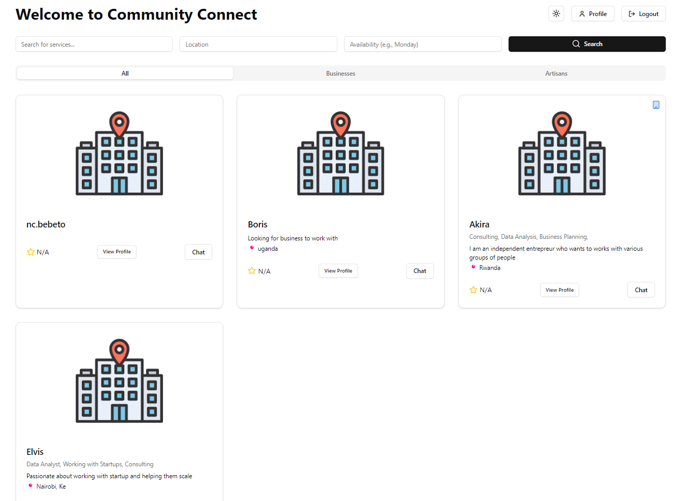

# Community Connect


## Project Overview

Community Connect is a platform designed to bridge the gap between local businesses, artisans, and service providers with their immediate community. This application enables users to discover local services, book appointments, and interact directly with service providers through a user-friendly interface.

## Features

- User Authentication
- Profile Management
- Search and Discovery
- Booking System
- Real-time Chat
- Ratings and Reviews

## Project Structure

The project is divided into two main components:

- `frontend/`: Contains the React-based frontend application
- `backend/`: Contains the backend server application

## Getting Started

1. Clone the repository:
   ```
   git clone https://github.com/ekinyua/community_connect.git
   cd community-connect
   ```

2. Set up the frontend:
   ```
   cd frontend
   npm install
   npm run dev
   ```

3. Set up the backend:
   ```
   cd backend
   npm install
   npm run dev
   ```

For more detailed instructions, please refer to the README files in the `frontend/` and `backend/` directories.

## Technologies Used

- Frontend: React, TypeScript, Redux
- Backend: Node.js, Express, MongoDB
- Testing: Jest, React Testing Library